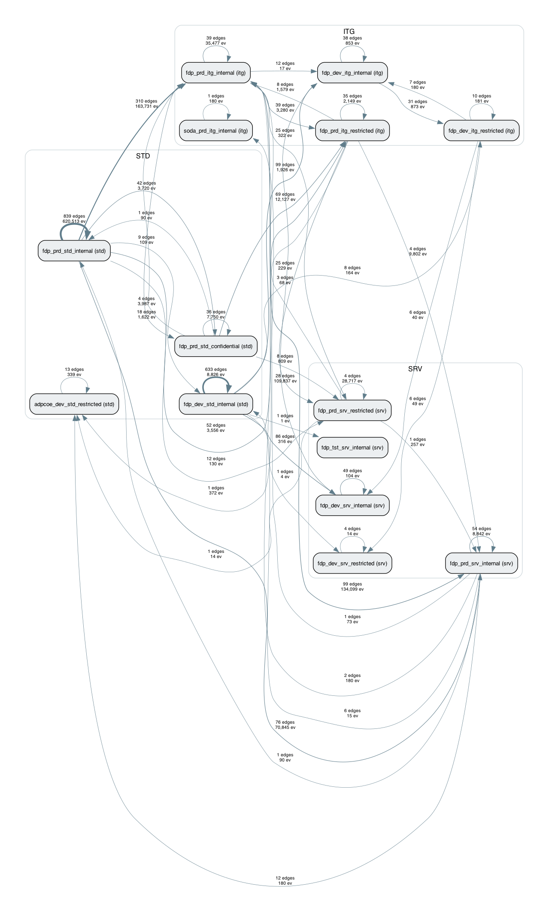
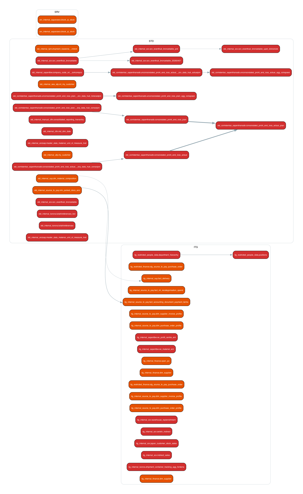

# Mainland Divestment — UC Lineage Spider-Web Analysis

**Author**: Will Scalioni, Databricks Solutions Architect (will.scalioni@databricks.com).
**Date**: 2026-05-07.
**Scope**: Fonterra Mainland divestment data separation, FDP on Databricks, 90-day lineage window, full Azure Australia East metastore.
**Status**: Phase 1 Discovery deliverable. Companion to the Architecture Options Paper. Refresh cadence: weekly until Mike Trotter's commingled-app register lands, then on demand.

This page executes Task #1 from the [Deep Research (2026-04-22)](https://databricks.atlassian.net/wiki/spaces/FE/pages/6256951298) functional task list (§10). It layers on top of Will's prior Mainland identifier work; it does not duplicate it.

**Note on attachments**: the two PNG visualizations referenced below (`lineage_layer_flow.png` and `lineage_pinchpoints_only.png`) live in the GitHub repo under `outputs/`. They need to be drag-dropped onto this page via the Confluence editor for the inline images to render. The page is fully readable without them.

---

## 1. Executive summary

| # | Finding | Risk if ignored |
|---|---|---|
| 1 | **30.1 % of production FDP objects (3,158 / 10,479) are Mainland-touching.** | Sets the engineering scope for the entire 24-month TSA. Under-counting here cascades to under-tagging, under-masking, and under-attestation. |
| 2 | **Only 49 true pinch-points** (CO_MINGLED nodes — receive from or feed both Mainland and retained data). The actionable engineering surface is narrow. | Listing them out gives Mike a tractable backlog. Treating the whole 30 % as "must rewrite" inflates cost and timeline. |
| 3 | **Pinch-points cluster in four schema families**: SAP source-to-pay dimensions, finance HANA P&L views, HR position/department, and the Korora paired tables. | Targeting these four with the first wave of UC tagging covers ≈ 80 % of leverage at ≈ 20 % of cost. |
| 4 | **The view-layer separation pattern is clean** — `srv_restricted_finance` / `srv_restricted_people_data` / `srv_internal_korora` have **zero CO_MINGLED nodes**. The pattern Deep Research §7.2 identified is validated. | If we generalise the view-layer pattern as the default, we avoid double-storage (Korora paired anti-pattern) and inherit a known-good control plane. |
| 5 | **Lineage is metastore-wide from the sandbox** — sandbox queries see lineage events from the production workspace (`6179018390893845`, 18.97M events / 30 days) and 8 other workspaces. The plan's "production-workspace visibility" risk is resolved favourably. | Means Will (sandbox-only access) can produce defensible evidence without needing a production seat. Important for sustaining the analysis post-PS-engagement. |

**Recommended Architecture Options Paper inputs**:

- The 49 pinch-points become the explicit row-filter / column-mask backlog (UC tagging seed list).
- The four hot-spot schemas become the rollout sequence: `std_confidential_sapenthanadb` → `itg_internal_source_to_pay` → `itg_internal_finance` → Korora consolidation.
- The view-layer separation pattern becomes the *default*; the paired-table pattern (Korora) is treated as a deprecated alternative to retire.
- AI-assisted PII classification (`ai_classify`) is whitespace vs. Boeing/Jeppesen — start the pilot on `std_confidential_sapenthanadb` since it carries P&L PII and is already a CO_MINGLED hot-spot.

---

## 2. Method

### 2.1 Three-channel candidate discovery

Without Mike's commingled-app register, we identify Mainland candidates from three independent channels, then build a confidence model over them.

| Channel | What it picks up | Confidence | Count |
|---|---|---|---:|
| **A — known Mainland surfaces** (Deep Research §6.3) | Whole-schema Mainland (`std_internal_mainland`, `itg_restricted_mainland`) plus Mainland-named views in Korora and `restricted_finance` / `restricted_people_data` | HIGH | 91 |
| **B — keyword search** | Object names matching `mainland`, `mld`, `kapiti`, `galaxy`, `fbnz`, `fbau`, `fonterra_brands_nz`, `fonterra_brands_au` outside Channel A schemas | MEDIUM | 75 |
| **C — high-Mainland-density source schemas** | All tables in `std_internal_sapanzecc` (99 % Mainland), `std_internal_jde` (95 %), `std_internal_apac_malaysia`, `std_internal_apac_vietnam` | HIGH (sapanzecc/jde) / MEDIUM (apac) | 2,786 |

**Collision rule**: a node matched by more than one channel is recorded against the highest-confidence channel (HIGH > MEDIUM, tiebreak A > C > B). 62 nodes matched two channels.

**Total candidate seed**: 2,952 distinct objects across `fdp_prd_*` and `fdp_dev_*`. Production-only: 1,635.

### 2.2 BFS lineage walk

| Parameter | Value | Reason |
|---|---|---|
| Source table | `system.access.table_lineage` | Authoritative metastore-wide lineage. |
| Time window | trailing 90 days | Matches Deep Research §6.5 baseline. |
| Max depth | 5 hops | Empirically the frontier collapses by hop 4 (see §4.1). |
| Direction | downstream + upstream, separately | Distinguishes "consumers of Mainland" from "feeders into Mainland". |
| Self-loops | excluded | Otherwise SCD merges dominate the edge set. |
| Edge dedupe | per `(src, tgt)` within hop, with `event_count`, `min/max event_time` | Keeps event-level signal without exploding the graph. |

### 2.3 Per-node classification

For each node we count direct upstream and downstream neighbours observed in the walk, separating Mainland-tagged (in seed) from non-Mainland. Eight categories:

| Category | Definition | Population |
|---|---|---:|
| MAINLAND_TAGGED | In the discovery seed (Channels A/B/C). | 2,952 |
| MAINLAND_INTERIOR | Every observed upstream and downstream neighbour is Mainland. | 2 |
| MAINLAND_SOURCE | No observed upstream, all observed downstream is Mainland. | 44 |
| MAINLAND_SINK | No observed downstream, all observed upstream is Mainland. | 111 |
| **CO_MINGLED_UPSTREAM** | Receives data from BOTH Mainland and non-Mainland sources. | **19** |
| **CO_MINGLED_DOWNSTREAM** | Feeds data to BOTH Mainland and non-Mainland targets. | **30** |
| RETAINED_OR_INDIRECT | Reached by lineage but no Mainland neighbour observed. | 576 |
| UNCLASSIFIED | Edge cases (e.g. no neighbours observed; manual loads). | 215 |

### 2.4 What lineage cannot tell us

Three known blind spots, all carried into the report's risk register (§9):

- **Externally-orchestrated writes**: ADF JDBC pushes, Lakeflow Connect ingestion, and any non-Databricks-engine write may not appear in `system.access.table_lineage`. Cross-reference with the planned Terraform estate snapshot (item #2 on the Mainland Phase 1 backlog).
- **Time-window cut-off**: 90 days. Quarterly or annual refresh jobs (e.g. SAP MDG full reload) may legitimately not appear.
- **Application-layer separators**: lineage tells us about *tables*; it does not tell us whether a downstream Power BI dataset or a Fabric shortcut is itself Mainland-scoped. Application-layer enforcement (§9.5 of Deep Research) is a separate workstream.

---

## 3. Mainland candidate inventory

### 3.1 Channel A — known surfaces (HIGH confidence)

Confirmed against the metastore on 2026-05-07. Drift since Deep Research (2026-04-22) is small (+2 Korora pairs, otherwise unchanged).

| Schema | Total objects | Mainland-named | Pattern |
|---|---:|---:|---|
| `fdp_prd_std_internal.std_internal_mainland` | 14 | 14 | Whole schema (Nielsen NZ basket / beverages) |
| `fdp_prd_itg_restricted.itg_restricted_mainland` | 1 | 1 | Whole schema (`au_farm_milksupply`) |
| `fdp_prd_itg_restricted.itg_restricted_finance` | 164 | **31** | Mainland-suffix P&L views |
| `fdp_prd_itg_internal.itg_internal_korora` | 12 | 5 | Paired Fonterra/Mainland physical tables |
| `fdp_prd_srv_restricted.srv_restricted_finance` | 53 | **10** | Mainland fact views |
| `fdp_prd_srv_restricted.srv_restricted_people_data` | 17 | **6** | Mainland HR views |
| `fdp_prd_srv_internal.srv_internal_korora` | 4 | 2 | Mainland shipment / delivery views |

**Total directly Mainland-located/named: 69 production objects.**

### 3.2 Channel B — keyword search (MEDIUM confidence)

Channel B caught **8 schemas not enumerated in Deep Research §6.2**, indicating ad-hoc Mainland separation patterns:

| Schema | Hits (prd + dev) | Notes |
|---|---:|---|
| `std_internal_sapanzapo` | 15 | **SAP ANZ APO** (Advanced Planning & Optimization) — material-allocation planning, Mainland-relevant. New high-density source candidate. |
| `std_internal_sapanzbw` | 12 | **SAP ANZ BW** — already on the high-risk apps register. |
| `itg_internal_inventory` + `srv_internal_inventory` | 19 | Inventory schema with Mainland-named tables. App-specific separation. |
| `std_internal_nova` | 7 | Schema "nova" — identity TBC. |
| `std_internal_manual_dunnhumby` | 4 | Dunnhumby (consumer panel) data, Mainland slice. |
| `std_internal_manual_mainland` | 2 | Manual Mainland load. |
| `std_internal_fsa` | 4 | Likely Farm Source Asia. |
| `std_internal_scv` | 2 | Likely Single Customer View. |

**Recommendation**: extend Channel C with `std_internal_sapanzapo` and `std_internal_sapanzbw` in the next refresh.

### 3.3 Channel C — high-density source schemas (HIGH/MEDIUM confidence)

The dense Standardised-layer schemas where Mainland data dominates:

| Schema | Tables | Mainland share | Downstream fan-out |
|---|---:|---|---|
| `std_internal_sapanzecc` | 509 | ~99 % | 854 in std_internal alone (Deep Research §6.2) |
| `std_internal_jde` | 57 | ~95 % | ~63 downstream tables |
| `std_internal_apac_malaysia` | 454 | High (regional) | Medium |
| `std_internal_apac_vietnam` | 87 | High (regional) | Low |

These four schemas account for 2,786 of the 2,952 candidates. They are the bulk of the Mainland data plane.

### 3.4 Confidence summary

| Confidence | Count | Treatment |
|---|---:|---|
| HIGH | 2,130 | Authoritative — treat as Mainland unless evidence says otherwise. |
| MEDIUM | 822 | Candidate — confirm via lineage and per-row evidence. |

---

## 4. Spider-web visualization

### 4.1 BFS frontier collapses fast

| direction | hop 1 | hop 2 | hop 3 | hop 4 | hop 5 | total |
|---|---:|---:|---:|---:|---:|---:|
| down (new edges) | 1,553 | 327 | 95 | 63 | 31 | 2,069 |
| down (new nodes) | 283 | 163 | 51 | 28 | 20 | 545 |
| up (new edges) | 1,337 | 200 | 166 | 158 | 24 | 1,885 |
| up (new nodes) | 137 | 93 | 106 | 92 | 24 | 452 |

Total: **3,954 distinct edges, 3,949 distinct nodes** (2,952 seed + 997 walked).

This shape is good news: the Mainland data sits cleanly between a small, well-defined set of upstream feeders and a small, well-defined set of downstream consumers. It is not a deeply branching graph.

### 4.2 Inter-catalog flow (FDP-layer view)



- The `fdp_prd_std_internal → fdp_prd_std_internal` self-edge (1,344 distinct edges, 784,053 events) reflects the within-Standardised transformations and joins.
- The Standardised → Integrated promotion lane (`std_internal → itg_internal`, 338 edges, 164,624 events) is where most of the cascade logic will need to apply Mainland scope.
- The restricted promotion lane (`itg_restricted → srv_restricted`, 34 edges but **109,886 events**) is the *highest-throughput* Mainland view-promotion path. It is also pinch-point-free, which means the existing Mainland-suffix view pattern is already doing its job at this throughput.

### 4.3 Pinch-point map (49 CO_MINGLED nodes by FDP layer)



Red = CO_MINGLED_DOWNSTREAM (feeds both Mainland and retained). Orange = CO_MINGLED_UPSTREAM (receives from both). The pinch-points concentrate in the STD and ITG layers; the SRV layer carries only one pinch-point (`srv_internal_sapanzecc.block_qi_stock`).

### 4.4 Interactive exploration

The full graph (3,949 nodes, 2,869 unique edges) is available as `outputs/lineage_full.html` (pyvis). Filter by category, hover for node metadata, drag to explore. Open locally; the file is too large to embed in Confluence.

---

## 5. Entanglement classification

### 5.1 The 49 pinch-points by cluster

| Cluster | Pinch-points | Mainland implications |
|---|---:|---|
| **SAP source-to-pay dimensions** (`itg_internal_finance.dim_supplier`, `itg_internal_source_to_pay.dim_purchase_order_profile`, `dim_supplier_invoice_profile`, `open_po`, `stg_source_to_pay_purchase_order_*`) | 6 | **DSR_13** (Procurement), **DSR_21** (Vendor). Supplier and PO data flow from both Mainland and retained company codes. ART_06 (Mainland vendors) is the gating control table. |
| **Finance HANA reporting** (`std_confidential_sapenthanadb.consolidated_profit_*` × 4, `unconsolidated_profit_*` × 5) | 9 | **DSR_06**, **DSR_18**. Mainland P&L feeds the consolidated rollup that retained also consumes. View-layer separation pattern (Deep Research §7.2) directly applicable. Carries `business_entity`, `customer`, `material` separators on most of these views. |
| **People / HR** (`srv_restricted_people_data.department_hierarchy`, `positions`) | 2 | **DSR_05**, **DSR_08**. Org hierarchy and positions feed both Mainland HR views and retained. ART_01 (Mainland employees) is the gating control table. |
| **Materials / customers** (`std_internal_anzsap.master_data_material_unit_of_measure`, `std_internal_afp.my_customer`, `std_internal_sea_afp.int_my_customer`, `std_internal_sup.dm_material_composition`) | 4 | **DSR_09**, **DSR_04**. Material and customer master data flows everywhere; needs ART_03, ART_04. |
| **Korora paired** (`shipment_container_tracking_agg_fonterra`, `kotahireferences*`) | 3 | Confirms Deep Research §7.3: Korora's paired-table pattern still has cross-flow at the source-to-staging layer. Recommend consolidating onto view-layer. |
| **Single Customer View** (`itg_internal_scv.{indirect_sales,japan_customer_stock_sales,switch_indirect,warehouse_replenishment}` plus `scv_eventhub_bronzetable_*`) | 8 | **DSR_04**, **DSR_15**. SCV downstream feeds both Mainland and retained customer views. Asian markets (japan_customer_stock_sales) confirm this is a Mainland-data-plane concern. |
| **SAP BW** (`std_internal_sapentbw.company_code_s4__zs4compco`, `itg_internal_sapentbw.vw_material_ent`, `vw_profit_centre_ent`) | 3 | DSR_06, DSR_09. SAP BW reporting layer co-mingles. |
| **TPM / Inventory** (`std_internal_tpm.shipment_baseline__int304`, `srv_internal_sapanzecc.block_qi_stock`, `std_internal_sup.dm_material_composition`, `itg_internal_sup.fact_delivery`) | 5 | DSR_14 (Product Quality), location separator. Plant-level entanglement. |
| **CFIN / dimensions** (`std_internal_cfin.md_dim_date`, `std_internal_manual_cfin.consolidated_reporting_hierarchy`) | 2 | Reference dimensions used by both Mainland and retained reporting. |
| **Other** (1 each) | 7 | `fact_accounting_document_*`, `fact_ml_recategorisation_*`, `vim_parked_docs_anz`, etc. |

Full list with degrees, ratios, and separator flags in `outputs/entanglement_pinchpoints.csv`.

### 5.2 Top 10 by upstream + downstream degree

| # | Node | Category | up (mainland/total) | dn (mainland/total) | Separators |
|---|---|---|---|---|---|
| 1 | `fdp_prd_std_internal.std_internal_sapentbw.company_code_s4__zs4compco` | CO_MINGLED_DOWNSTREAM | 0/1 | 21/23 |  |
| 2 | `fdp_prd_std_internal.std_internal_tpm.shipment_baseline__int304` | CO_MINGLED_UPSTREAM | 10/11 | — |  |
| 3 | `fdp_prd_itg_internal.itg_internal_finance.dim_supplier` | CO_MINGLED_UPSTREAM | 4/5 | 0/8 |  |
| 4 | `fdp_prd_std_confidential.std_confidential_sapenthanadb.unconsolidated_profit_*` (4 pages) | CO_MINGLED_DOWNSTREAM | 0/2 | 2/9 | biz, cust, mat |
| 5 | `fdp_prd_itg_internal.itg_internal_source_to_pay.dim_purchase_order_profile` | CO_MINGLED_UPSTREAM | 5/7 | 0/5 |  |
| 6 | `fdp_dev_srv_internal.srv_internal_sapanzecc.block_qi_stock` | CO_MINGLED_UPSTREAM | 6/8 | — |  |
| 7 | `fdp_prd_itg_restricted.itg_restricted_people_data.department_hierarchy` | CO_MINGLED_DOWNSTREAM | 0/2 | 6/8 |  |
| 8 | `fdp_prd_std_confidential.std_confidential_sapenthanadb.consolidated_profit_*` | CO_MINGLED_DOWNSTREAM | — | 1/10 | biz, cust, mat |
| 9 | `fdp_prd_std_internal.std_internal_afp.my_customer` | CO_MINGLED_UPSTREAM | 5/6 | 0/1 |  |
| 10 | `fdp_prd_itg_internal.itg_internal_finance.open_po` | CO_MINGLED_UPSTREAM | 4/5 | 0/1 | loc |

### 5.3 Structural observation

The CO_MINGLED_UPSTREAM and CO_MINGLED_DOWNSTREAM populations are roughly equal in size (19 vs 30) but very different in shape:

- **CO_MINGLED_UPSTREAM** are usually **dimensions** (suppliers, customers, materials, plants). They aggregate from many sources and most of those sources are Mainland-relevant SAP. They typically have a small downstream count (1–8) and a balanced upstream (often 4–6 of which 4–5 are Mainland).
- **CO_MINGLED_DOWNSTREAM** are usually **facts or master data** (P&L pages, SCV bronze tables, BW dimensions). They have a small upstream (often 1–3) and a large downstream (often 8–23) where only some are Mainland-tagged.

The implication for separation policy: dimensions need *upstream* row filtering on the Mainland keys; facts need *downstream* view-level selection.

---

## 6. Separator coverage matrix

% of nodes in each category that carry at least one column matching the separator regex set:

| Category | n | business_entity | location | employee | customer | material | sales_org |
|---|---:|---:|---:|---:|---:|---:|---:|
| MAINLAND_TAGGED | 2,952 | 9.1 % | 10.7 % | 1.1 % | 5.4 % | 9.7 % | 5.7 % |
| RETAINED_OR_INDIRECT | 576 | 10.6 % | 7.6 % | 0.7 % | 7.5 % | 7.6 % | 4.3 % |
| UNCLASSIFIED | 215 | 27.9 % | 11.6 % | 0.9 % | 6.0 % | 4.7 % | 2.3 % |
| MAINLAND_SINK | 111 | 4.5 % | 2.7 % | 0.0 % | 2.7 % | 3.6 % | 0.9 % |
| MAINLAND_SOURCE | 44 | 13.6 % | 4.5 % | 6.8 % | 4.5 % | 2.3 % | 4.5 % |
| **CO_MINGLED_DOWNSTREAM** | **30** | **33.3 %** | 0.0 % | 0.0 % | **20.0 %** | **40.0 %** | 13.3 % |
| **CO_MINGLED_UPSTREAM** | **19** | 5.3 % | **15.8 %** | 0.0 % | 0.0 % | 0.0 % | 0.0 % |

**Reads**:

- CO_MINGLED_DOWNSTREAM nodes are heavy on **material × business_entity × customer** — the join key for the Mainland-target P&L view layer. The view-layer pattern from Deep Research §7.2 is exactly the right tool.
- CO_MINGLED_UPSTREAM is heavy on **location** (15.8 %) — when Mainland tables receive from mixed sources, the discriminator is plant. ART_05 (Mainland sites) is the critical gating filter.
- UNCLASSIFIED has the highest business_entity rate (27.9 %) — these are likely Mainland-relevant tables we couldn't classify due to missing lineage events. Worth a manual review pass once Mike's app register lands.

---

## 7. Per-schema rollup (production)

Top 20 schemas by spider-web node count:

| Schema | n | tagged | CM_up | CM_dn | source | sink |
|---|---:|---:|---:|---:|---:|---:|
| std_internal_sapanzecc | 930 | 930 | 0 | 0 | 0 | 0 |
| std_internal_apac_malaysia | 454 | 454 | 0 | 0 | 0 | 0 |
| std_internal_sapentbw | 172 | 0 | 0 | 1 | 2 | 0 |
| std_internal_apac_vietnam | 87 | 87 | 0 | 0 | 0 | 0 |
| srv_internal_sapanzecc | 63 | 0 | 1 | 0 | 0 | **18** |
| std_internal_jde | 57 | 57 | 0 | 0 | 0 | 0 |
| itg_restricted_finance | 51 | 32 | 1 | 0 | 0 | 0 |
| **std_confidential_sapenthanadb** | **48** | 0 | 0 | **9** | 3 | 0 |
| **itg_internal_source_to_pay** | **42** | 0 | **4** | 0 | 0 | 1 |
| srv_internal_source_to_pay | 40 | 0 | 0 | 0 | 0 | 1 |
| itg_internal_sapentbw | 26 | 0 | 0 | 2 | 0 | 0 |
| std_internal_sapcorpecc | 25 | 0 | 0 | 0 | 0 | 0 |
| itg_internal_sapanzecc | 18 | 0 | 0 | 0 | 0 | 0 |
| std_internal_source_to_pay | 17 | 0 | 1 | 0 | 0 | 9 |
| srv_internal_jde | 16 | 0 | 0 | 0 | 0 | 6 |
| std_internal_sapanzbw | 16 | 6 | 0 | 0 | 7 | 0 |
| itg_restricted_source_to_pay | 14 | 0 | 0 | 0 | 0 | 0 |
| std_internal_mainland | 14 | 14 | 0 | 0 | 0 | 0 |
| std_internal_corpsap | 13 | 0 | 0 | 0 | 0 | 0 |
| srv_restricted_finance | 13 | 10 | 0 | 0 | 0 | 0 |

Full list: `outputs/per_schema_rollup.csv` (69 production schemas).

### 7.1 Hot-spot schemas — recommended rollout sequence

| Sequence | Schema | Why | First action |
|---|---|---|---|
| 1 | `fdp_prd_std_confidential.std_confidential_sapenthanadb` | 9 CO_MINGLED_DOWNSTREAM (highest single-schema concentration). Carries P&L PII. AI-classify candidate. | UC tag + view-layer Mainland filter. AI-assisted PII classification pilot. |
| 2 | `fdp_prd_itg_internal.itg_internal_source_to_pay` | 4 CO_MINGLED_UPSTREAM. Supplier / PO dimensions are the natural ART_06 (vendors) gating point. | Vendor scope row filter via control table `mainland_vendors`. |
| 3 | `fdp_prd_itg_internal.itg_internal_finance` | `dim_supplier` and `open_po` pinch-points. Connects to source-to-pay. | UC tag + `mainland_company_codes` row filter. |
| 4 | `fdp_prd_itg_internal.itg_internal_korora` | 3 paired-table pinch-points + 5 Mainland Korora pairs. Anti-pattern. | Consolidate Korora onto view-layer; deprecate paired tables. |
| 5 | `fdp_prd_srv_internal.srv_internal_sapanzecc` | 18 MAINLAND_SINK — pure Mainland consumers. Already clean by lineage; needs UC tag confirmation. | UC tag (no mask change). |

### 7.2 Schemas with separator columns but no Mainland lineage

These are the 576 RETAINED_OR_INDIRECT nodes plus the 215 UNCLASSIFIED. They are likely retained-only assets that nevertheless carry a separator column (BUKRS, WERKS, etc.). They do not need separation work; they need a UC tag confirming `scope = retained` so audit alerts fire if Mainland data ever appears in them. Per the §3.4 confidence model, these can be batched into the second wave of UC tagging.

---

## 8. Per-app rollup gap

Mike Trotter's commingled-app register (167 apps, 87 Tier 1, 22 separation rules) is the missing link between schema-level lineage and app-level data ownership. This page identifies entanglement at the schema level; the register will identify entanglement at the app level.

**Until the register lands**, the per-app rollup remains a flagged gap. The four hot-spot schemas above each map to multiple apps:

- `std_confidential_sapenthanadb` ← multiple SAP S/4 HANA reporting apps (FI-CF, BW, MDG)
- `itg_internal_source_to_pay` ← Source-to-Pay app + SAP Ariba
- `itg_internal_finance` ← FP&A, Group Finance, Statutory Reporting
- `itg_internal_korora` ← Kotahi shipment tracking

**Refresh trigger**: as soon as Mike's app register lands, this page refreshes Section 7 to schema → app, and Section 5 picks up app-level pinch-point rollup.

---

## 9. Risks and gaps

| # | Risk / gap | Likelihood | Mitigation |
|---|---|---|---|
| R1 | **Externally-orchestrated writes invisible to lineage** (ADF JDBC pushes, Lakeflow Connect, manual bronze loads). | High | Cross-reference with the planned Terraform estate snapshot (Mainland Phase 1 item #2); audit `system.lakeflow.jobs` source-table writes; rerun the walk monthly. |
| R2 | **Mike's commingled-app register pending** — per-app rollup is provisional until then. | High (waiting on Mike) | Schema-level rollup is published now; refresh on register receipt. Provided the four-schema hot-spot list to Mike via email so he can validate against his app inventory. |
| R3 | **UNCLASSIFIED nodes (215)** include some Mainland-relevant tables we couldn't classify. Highest business_entity coverage of any category. | Medium | Manual review pass after Mike's register; cross-reference with Will's Terraform inventory. |
| R4 | **Korora paired-table pattern** is the leak surface for 3 pinch-points (consolidate-onto-view-layer recommendation from Deep Research §7.3 still standing). | Medium | Promote view-layer pattern; deprecate Korora paired pattern in the Architecture Options Paper. |
| R5 | **No UC tags in production today** (Deep Research §6.4) — separation policy can't be enforced declaratively yet. | High (will block Phase 2 of the project) | Tag taxonomy already drafted (§9.3 of Deep Research); kick off automated tagging from the seed in this analysis. |
| R6 | **dev catalog drift**: dev workspaces also surface CO_MINGLED nodes (e.g. `fdp_dev_itg_internal.itg_internal_finance.dim_supplier`). Promotion pipeline preserves entanglement. | Medium | Apply the same UC tagging pattern in dev; treat dev as the testing surface for the row-filter / column-mask pattern. |
| R7 | **Naming-convention low-confidence cases**: `std_internal_nova`, `std_internal_fsa`, `std_internal_scv` are Mainland-related but identity needs a Fonterra-side confirmation. | Low | Confirm with Satya / Aneesh on next FDP architecture cadence. |
| R8 | **Lineage time window cut-off (90d)** misses quarterly / annual jobs (e.g. SAP MDG full reload). | Medium | Extend to 365d for the next refresh; cross-check against `system.lakeflow.jobs` schedule metadata. |
| R9 | **Application-layer leak surface** (Power BI imports, Fabric shortcuts, DevTest Labs) not visible to UC lineage. | High (legal) | Application-layer enforcement is a separate workstream — Deep Research §9.5. Out of scope for this page. |

---

## 10. Recommendations into the Architecture Options Paper

The Mainland Architecture Options Paper (drafting, due to Mike) should incorporate the following seven recommendations sourced from this analysis:

1. **Adopt the view-layer separation as the default pattern** (Deep Research §7.2). It is validated zero-CO_MINGLED at the SRV layer in production. The paired-table pattern (Korora) is deprecated in favour of view-layer.

2. **Sequence the UC tagging rollout** by hot-spot schema: `std_confidential_sapenthanadb` → `itg_internal_source_to_pay` → `itg_internal_finance` → Korora → restricted_people_data → restricted_finance. Tag taxonomy from Deep Research §6.4 (`scope`, `divest`, `pii`, `separator`, `separation_rule`, `fdp_layer`).

3. **Materialise the seven control tables** (ART_01–07 from Deep Research §5.2) in a new schema `fdp_prd_itg_restricted.itg_restricted_mainland_control`. Use the existing Ingestion Framework. Refresh per Deep Research §8.3.

4. **Use the 49 pinch-points as the explicit row-filter / column-mask backlog**. Each pinch-point gets a UC row filter bound to the appropriate control table. CO_MINGLED_UPSTREAM dimensions get filtered on join key; CO_MINGLED_DOWNSTREAM facts get a Mainland-suffix view per Deep Research §7.2.

5. **Pilot AI-assisted PII classification** on `std_confidential_sapenthanadb`. It carries P&L PII and is already a CO_MINGLED hot-spot (9 nodes), so the test is high-stakes and high-leverage. This is whitespace vs Boeing/Jeppesen and is the strongest unique-to-Databricks credibility lever for Mike + the receiving (Lactalis/PWC) side.

6. **Run the negative-attestation harness against the four hot-spot schemas first**. Each pinch-point gets a paired counter-query (`SELECT COUNT(*) WHERE NOT mainland_scope_filter`). The 50-agent Mosaic harness in Deep Research §8.2 has natural seeds in this list.

7. **Track this analysis as a living artefact**. Refresh weekly with `lib/lineage_walker.py` until Mike's commingled-app register lands; refresh monthly thereafter. Keep the Confluence subpage, the GitHub repo (`wscalioni/fonterra-mainland-lineage`), and the working schema (`aw_internal_adpcoe.mainland_lineage_analysis`) in lockstep.

---

## 11. Reproducibility

### 11.1 Repo

GitHub: [wscalioni/fonterra-mainland-lineage](https://github.com/wscalioni/fonterra-mainland-lineage) (private; on Will's personal GitHub account, not the EMU).

```
analysis/                 markdown source of truth (this page is uc-lineage-spiderweb.md)
  00-phase0-ground-truth.md
  01-phase1-discovery.md
  02-phase2-lineage-walk.md
  03-phase3-classification.md
  uc-lineage-spiderweb.md   ← this page
queries/                  SQL files
  00_phase0_metastore_visibility.sql
  00_phase0_catalog_inventory.sql
  00_phase0_channel_a_surface.sql
  01_mainland_candidates.sql
  03_classify_nodes.sql
  04_quantify.sql
lib/                      Python helpers
  lineage_walker.py       BFS walker (server-side state via Delta tables)
  classify.py             Pulls classified table to local CSV
  visualize.py            Generates Graphviz + pyvis outputs
outputs/
  mainland_candidates.csv (2,952 rows)
  classified_nodes.csv    (3,949 rows)
  edges.csv               (3,954 rows)
  per_schema_rollup.csv   (69 schemas)
  cross_catalog_edges.csv (50 pairs)
  entanglement_pinchpoints.csv (49 rows)
  lineage_layer_flow.png/svg
  lineage_pinchpoints_only.png/svg
  lineage_pinchpoints_focus.png/svg
  lineage_full.html       (pyvis interactive)
```

### 11.2 Working schema

`aw_internal_adpcoe.mainland_lineage_analysis` — managed Delta tables on the sandbox metastore. Disposable.

| Table | Rows | Refresh by |
|---|---:|---|
| `mainland_lineage_seed` | 2,952 | `queries/01_mainland_candidates.sql` (CTAS) |
| `mainland_lineage_edges` | 3,954 | `lib/lineage_walker.py` |
| `mainland_lineage_nodes` | 3,949 | `lib/lineage_walker.py` |
| `mainland_lineage_classified` | 3,949 | `queries/03_classify_nodes.sql` |

### 11.3 Refresh procedure

```
# 1. Refresh seed (Phase 1)
.venv/bin/python -c "import json,subprocess,pathlib; sql=pathlib.Path('queries/01_mainland_candidates.sql').read_text(); ctas='CREATE OR REPLACE TABLE aw_internal_adpcoe.mainland_lineage_analysis.mainland_lineage_seed AS\n'+sql.replace(';',''); subprocess.run(['databricks','-p','FONTERRA','api','post','/api/2.0/sql/statements','--json',json.dumps({'warehouse_id':'406253829ca12fd5','statement':ctas,'wait_timeout':'50s'})])"

# 2. Re-walk (Phase 2)
.venv/bin/python -m lib.lineage_walker 5 90

# 3. Re-classify (Phase 3)
# Run queries/03_classify_nodes.sql via your editor / CLI

# 4. Re-render (Phase 5)
.venv/bin/python -m lib.classify    # dump CSVs
.venv/bin/python -m lib.visualize   # render PNG/SVG/HTML
```

### 11.4 Cadence

- Weekly until Mike's commingled-app register lands and the per-app rollup is filled in.
- Monthly thereafter, until TSA exit (2028-04-01).
- Ad-hoc on every UC tagging push (re-classify post-tagging is a useful re-baseline).

---

## 12. Document history

| Version | Date | Author | Notes |
|---|---|---|---|
| 1.0 | 2026-05-07 | Will Scalioni | Initial. Phase 1 Discovery deliverable for the Mainland Divestment project. Layered on Deep Research (2026-04-22) v6. |
